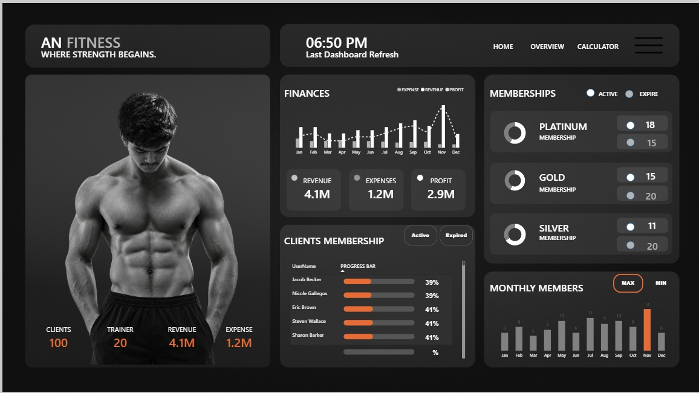
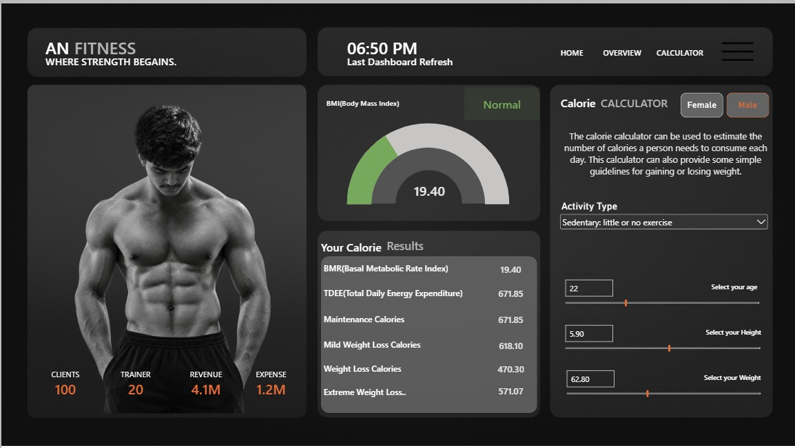

# 📊 Power BI Analytics & Business Intelligence Portfolio

Welcome to my Power BI portfolio repository! This repository showcases interactive end-to-end Power BI dashboards designed to transform raw data into actionable business intelligence through automated data pipelines, robust data modeling, and intuitive user experiences.

---

## 🏋️ 1. AN Fitness Performance & Health Analytics Dashboard

### 📌 Project Overview & Problem Statement
Gym aur fitness businesses ke liye member engagement, workout consistency aur health progress track karna challenging hota hai. Is dashboard ka goal workout performance metrics, member activity patterns, aur daily fitness tracking ko automate karna hai taaki trainers aur members real-time insights le sakein.

### 📸 Dashboard Visuals

#### 1. Home Navigation View


#### 2. Overview Dashboard


#### 3. Health & Fitness Metrics Calculator


### ⚙️ What Was Done (Methodology & Implementation)
- **Data Transformation (Power Query):**
  - Raw fitness datasets (`AN Dataset.xlsx`) ko clean, standardize aur format kiya.
  - Missing values handle kiye aur custom date & workout dimension tables banaye.
- **Data Modeling & Architecture:**
  - Fact & Dimension tables ke beech clean 1-to-Many relationships establish kiye.
- **DAX Calculations & Custom Metrics:**
  - Dynamic measures banaye for daily workout frequency, active vs inactive member ratios, aur target completion percentages.
  - Interactive BMI aur calorie estimation metrics logic implement kiya.
- **UI/UX Design:**
  - Dark modern aesthetic with custom navigational buttons, card KPI blocks, aur dynamic slicers.

---

## 🚗 2. Uber Rides & Operational Analytics Dashboard

### 📌 Project Overview & Problem Statement
Ridesharing operations mein driver efficiency, booking cancellations, customer demand trends, aur peak revenue windows ko optimize karna zaroori hota hai. Yeh project Uber booking transactions data ka granular analysis karta hai taaki operational bottlenecks aur revenue trends identify kiye ja sakein.

### 📸 Dashboard Visuals

#### 1. Uber Home Screen


#### 2. Operational Overview & Revenue Analysis


### ⚙️ What Was Done (Methodology & Implementation)
- **Data Preprocessing & Cleaning:**
  - `uber.xlsx` raw transactional data ko normalize kiya.
  - Booking timestamps se hour-of-day, day-of-week, aur trip duration columns extract kiye.
- **Exploratory Data Analysis (EDA) & KPIs:**
  - Total Bookings, Completed vs Cancelled Rides, Gross Booking Value (GBV), aur Average Fare per Trip evaluate kiya.
  - Driver vs Customer cancellation reasons ko segment kiya.
- **Advanced DAX & Analytical Measures:**
  - Time Intelligence measures use karke MoM (Month-over-Month) trip volume aur peak-hour surge trends identify kiye.
  - Dynamic categorical filters apply kiye (Payment Method, Vehicle Category, Pickup Hotspots).
- **Executive Visualizations:**
  - Clean heatmaps, trend lines, donut charts, aur single-glance KPI cards banaye.

---

## 🛠️ Tech Stack & Skills Demonstrated
- **BI Platform:** Power BI Desktop, Power BI Service
- **Analytics & Querying:** DAX (Data Analysis Expressions), Power Query (M Language)
- **Data Modeling:** Star Schema, 1-to-Many Relationships, Dimension Modeling
- **Data Sources:** Microsoft Excel (`.xlsx`), CSV
- **Design:** Interactive UX/UI, Custom Bookmarks, Dynamic Slicers & Page Navigation

---

## 🚀 How to Explore These Dashboards Locally
1. Clone this repository:
```bash
git clone https://github.com/dogranishant95/POWER-BI-PROJECTS.git
```
